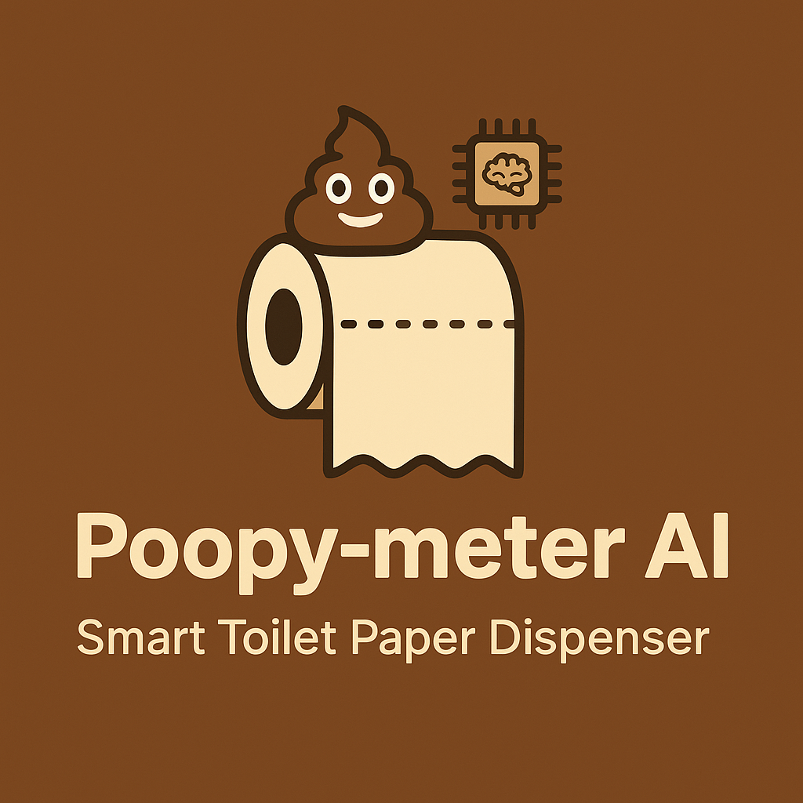

# Toilet Smart AI

This project is a small application demonstrating a much-needed toilet paper dispenser controlled by a React Native app. The project was bootstrapped with [`create-expo-app`](https://www.npmjs.com/package/create-expo-app) and uses [file‑based routing](https://docs.expo.dev/router/introduction). 

The app offers:  
1) SoundWaveVisualizer with animated concentric circles that pulse during recording
2) RecordButton with spring animations and color changes
3) Bluetooth connection to TP-Dispenser-Pro device
4) Audio recording and AI analysis to determine optimal sheet count
5) Bluetooth command transmission to physical dispenser
6) Real-time motor control and dispensing progress
7) Protocol interface showing available BLE commands
8) Main app integrating all components with simulated audio amplitude, AI analysis workflow, and automatic dispensing.

The app features a 2-screen view: 
1) Initial recording screen (app/index.tsx) with sound wave visualizer and record button, plus navigation to control screen after recording
2) Control screen (app/control.tsx) with AI analysis, Bluetooth management, dispenser controller, and toilet paper dispenser components

Yes, this is real. Yes, I did spend *some* time working on it. 

Last but not least, licensed under the "FLIP 0FF license". 



## Prerequisites

- **Node.js** 18 or newer
- **npm** 9 or newer

Install the project dependencies after cloning the repository:

```bash
npm install
```

## Running the application

Start Expo in development mode:

```bash
npx expo start
```

The terminal output includes options to open the app in a development build, Android emulator, iOS simulator or Expo Go.

### Useful scripts

- `npm run android` – start the Android emulator
- `npm run ios` – start the iOS simulator
- `npm run web` – run the web build
- `npm run lint` – run ESLint (requires the Expo CLI)
- `npm run build` – export a static web build
- `npm run reset-project` – move the current `app` directory to `app-example` and create a fresh `app`

## Maintenance

To check TypeScript types without emitting files:

```bash
npx tsc --noEmit
```

Audit dependencies for known vulnerabilities:

```bash
npm audit --omit=dev
```

Running `npm audit fix` will attempt to update packages to patched versions.

## Resetting the starter code

If you want to begin from a blank slate, run:

```bash
npm run reset-project
```

The script moves the existing `app` directory to `app-example` and creates a fresh `app` folder containing a minimal screen.

## Learning resources

- [Expo documentation](https://docs.expo.dev/)
- [Expo guides](https://docs.expo.dev/guides)
- [Learn Expo tutorial](https://docs.expo.dev/tutorial/introduction/)

## Community

- [Expo on GitHub](https://github.com/expo/expo)
- [Discord community](https://chat.expo.dev)

## 🫵 You cloned this? Really?

If you're going to clone this masterpiece of bathroom-based overengineering and not even leave a star,
the least you can do is stare at yourself in the mirror and ask:
“What kind of person am I?”

Stars are free. Shame is forever.
